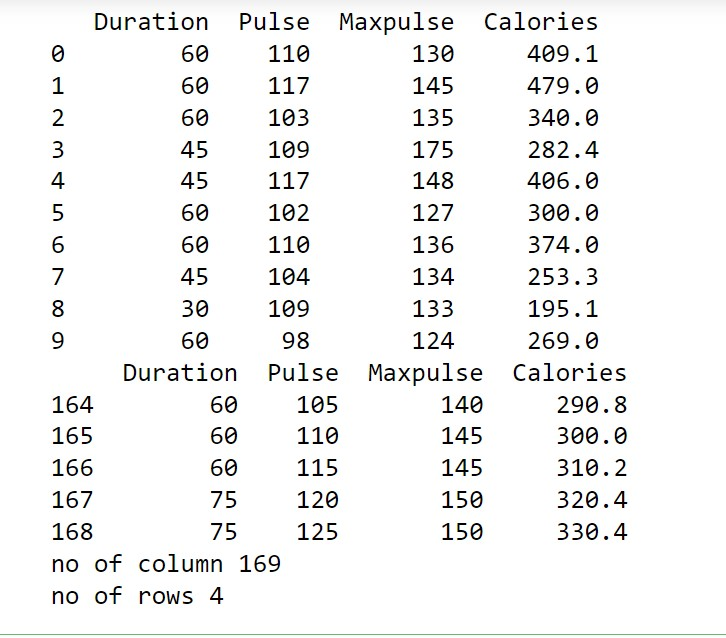

# Read-from-CSV

## AIM:
To write a python program to read contents from a csv file.

## ALGORITHM:
### Step 1:
Import pandas library using import statement.

### Step 2:
Read the contents of the given csv file using read_csv() method and pass the name of the file with '.csv' extension as the argument. Make sure that the data file and the python program are saved in the same location, otherwise mention the file's full path.

### Step 3:
Display the first few indices of the file using head() method and pass required number of indices as the argument. The default number of indices displayed is 5.

### Step 4:
Display the last few indices of the file using tail() method and pass required number of indices as the argument. The default number of indices displayed is 5.

### Step 5:
Display the number of rows and columns of the file using len() and axes() method and pass argument as 0 to display row and 1 to display column.

## PROGRAM:
```
import pandas as pd
df=pd.read_csv('data.csv')
print(df.head(10))
print(df.tail())
print("no of column",len(df.axes[0]))
print("no of rows",len(df.axes[1]))
```

## OUTPUT:



## RESULT:
Thus the python program to read contents from a csv file is successfully executed.